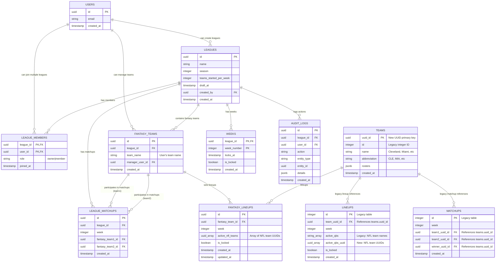

# Database Schema Diagram

## Multi-League Architecture Overview

This diagram shows the proper multi-league database schema that separates NFL teams (QB sources) from fantasy teams (league participants).

## Key Design Principles

### 🎯 **Clear Separation of Concerns**
- **NFL Teams** (`teams`) - The 32 NFL franchises, shared across all leagues
- **Fantasy Teams** (`fantasy_teams`) - User-created teams within specific leagues
- **Matchups** (`league_matchups`) - Fantasy team vs fantasy team battles
- **Lineups** (`fantasy_lineups`) - Which NFL teams each fantasy team starts

### 🔒 **Multi-League Support**
- Fantasy teams are scoped to specific leagues
- Same user can have different team names in different leagues
- Proper isolation between leagues

### 🚀 **Scalable Architecture**
- UUID primary keys for better distribution
- Clear foreign key relationships
- No redundant winner storage (calculated from scores)

## Table Descriptions

### Core Tables

#### `fantasy_teams`
The actual participants in leagues. Each fantasy team:
- Belongs to exactly one league
- Has a unique name within that league
- Is managed by one user
- Can participate in matchups and set lineups

#### `league_matchups`
Fantasy team vs fantasy team battles:
- No winner_id field (winners calculated from scores)
- Clear references to fantasy teams, not NFL teams
- Proper week-based scheduling

#### `fantasy_lineups`
Which NFL teams each fantasy team starts:
- `active_nfl_teams` - Array of NFL team UUIDs
- Clear naming: these are NFL teams, not QBs or fantasy teams
- Proper foreign key to fantasy team

### Legacy Tables

#### `lineups` & `matchups`
Kept for backward compatibility during migration:
- Will be phased out once new system is stable
- Contains both old (integer) and new (UUID) references
- Bridges old and new architectures

## Views and Functions

The schema includes several views for easy data access:

- `v_fantasy_teams` - Fantasy teams with manager info
- `v_league_matchups` - Matchups with team names and manager details
- `v_fantasy_lineups` - Lineups with NFL team names for display

## Migration Strategy

This schema represents the target state after the proper multi-league migration:

1. **Phase 1**: Convert existing schema to UUID (completed)
2. **Phase 2**: Add new proper tables (fantasy_teams, league_matchups, fantasy_lineups)
3. **Phase 3**: Migrate data from legacy tables to new tables
4. **Phase 4**: Update application code to use new tables
5. **Phase 5**: Deprecate legacy tables (future)

## Benefits

### ✅ **Intuitive Design**
- Table names clearly indicate purpose
- Field names are self-documenting
- Relationships are obvious

### ✅ **Multi-League Ready**
- Proper data isolation
- Scalable to many leagues
- No naming conflicts

### ✅ **Performance Optimized**
- UUID indexes for fast lookups
- Proper foreign keys for query optimization
- Minimal data duplication